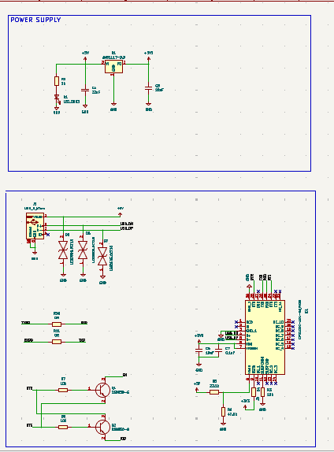
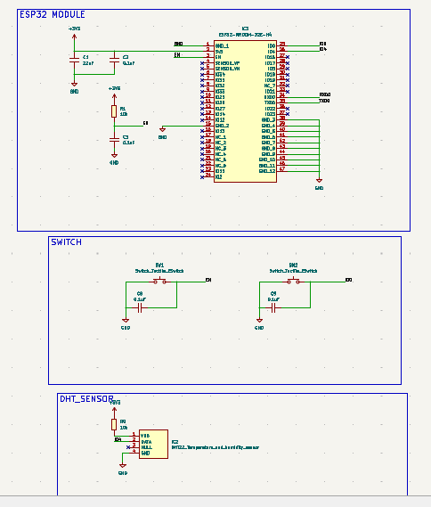

# ESP32 Development Board PCB Design

## Overview

This project presents the design of a custom ESP32 Development Board PCB developed using KiCad. The board includes USB connectivity, a regulated 3.3V power supply, reset and boot circuits, and a DHT22 temperature and humidity sensor interface. The design follows the complete PCB development workflow from schematic capture to PCB layout and Gerber generation.

---

## Features

- ESP32 Development Board
- DHT22 Temperature & Humidity Sensor Interface
- USB Power Input
- 3.3V Voltage Regulator
- Reset (EN) Button
- Boot Button
- Status LED
- Two-Layer PCB Design

---

## Software Used

- KiCad

---

## Hardware Components

- ESP32-WROOM Module
- DHT22 Sensor
- USB Connector
- AMS1117-3.3V Voltage Regulator
- Push Buttons
- LEDs
- Resistors
- Capacitors
- Transistor

---

## Design Flow

1. Schematic Design
2. ERC Verification
3. PCB Layout
4. Component Placement
5. Routing
6. DRC Verification
7. Gerber Generation

---

## Design Verification

- ERC Passed ✅
- DRC Passed ✅
- Gerber Files Generated Successfully ✅
- Ready for PCB Fabrication ✅

---

## Repository Structure

```
ESP32-Development-Board-PCB-Design
│
├── ESP32_DHT.kicad_sch
├── ESP32_DHT.kicad_pcb
├── README.md
│
├── Gerber/
│
└── Images/
    ├── Schematic.png
    ├── PCB_Toplayer.png
    └── PCB_Bottomlayer.png
```

---

## Project Images

### Schematic





### PCB Layout - Top View


### PCB Layout - Bottom View


---

## Author

**Indhira A**

Electronics and Communication Engineering Student

Interested in PCB Design, Embedded Systems and IoT.
